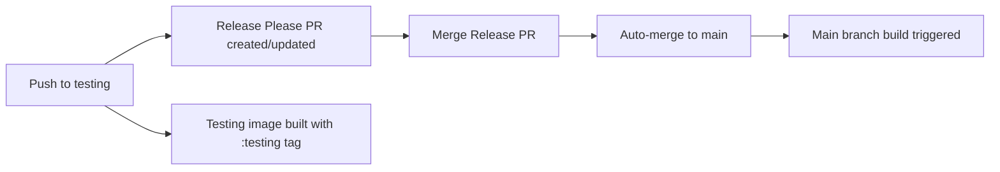

# Release Workflow with Release Please

This repository uses [Release Please](https://github.com/googleapis/release-please) to automate version management and releases.

## Overview

The release workflow is designed to support a **testing → main** branching model:

1. **Development happens on `testing` branch** - Maintainers push changes here
2. **Release Please tracks changes** - Automatically creates/updates a release PR
3. **Merge the release PR** - Triggers automatic merge to `main` branch
4. **Both branches build images** - `testing` gets `:testing` tag, `main` gets `:stable` tag

## Workflow



## How to Use

### 1. Push Changes to Testing Branch

All development work should be pushed to the `testing` branch:

```bash
git checkout testing
# Make your changes
git add .
git commit -m "feat: add new feature"
git push origin testing
```

### 2. Use Conventional Commits

Release Please uses [Conventional Commits](https://www.conventionalcommits.org/) to determine version bumps:

| Commit Type | Version Bump | Example |
|-------------|--------------|---------|
| `feat:` | Minor (0.x.0) | `feat: add homebrew support` |
| `fix:` | Patch (0.0.x) | `fix: correct flatpak installation` |
| `feat!:` or `BREAKING CHANGE:` | Major (x.0.0) | `feat!: change base image to bazzite` |
| `docs:`, `chore:`, etc. | No bump | `docs: update README` |

**Examples:**

```bash
# Feature - Bumps minor version
git commit -m "feat: add cosmic desktop example"

# Bug fix - Bumps patch version
git commit -m "fix: correct systemd service enablement"

# Breaking change - Bumps major version
git commit -m "feat!: migrate to new build system

BREAKING CHANGE: Requires manual migration of custom scripts"

# Chore - No version bump, but included in changelog
git commit -m "chore: update dependencies"

# Multiple types in one commit
git commit -m "feat: add new ujust commands

- Add brewfile shortcuts
- Add system update command
- Fix typo in README"
```

### 3. Release Please PR

After pushing to `testing`, Release Please will:

- **Create a Release PR** if one doesn't exist
- **Update the Release PR** with new commits
- **Generate CHANGELOG.md** with all changes
- **Bump version** in `.release-please-manifest.json`

The PR title will be: `chore(main): release X.Y.Z`

### 4. Merge the Release PR

When you're ready to release:

1. **Review the Release PR** - Check the changelog and version bump
2. **Merge the PR** - This triggers:
   - Creates a GitHub Release with the changelog
   - Automatically merges `testing` → `main`
   - Triggers a build of the `main` branch (`:stable` tag)

**Important:** Do NOT manually merge `testing` to `main`. Always use the Release Please PR.

### 5. Testing Images

Every push to `testing` branch builds an image with the `:testing` tag:

```bash
# Test the latest testing image
sudo bootc switch --transport registry ghcr.io/YOUR_USERNAME/YOUR_REPO_NAME:testing
sudo systemctl reboot
```

## Version Management

Versions are managed in `.release-please-manifest.json`:

```json
{
  ".": "1.2.3"
}
```

Release Please automatically updates this file based on your commits.

## Branch Protection

Recommended branch protection rules:

### Testing Branch
- Require status checks to pass (build workflow)
- Require linear history
- Allow force pushes (for maintainers only)

### Main Branch
- Require status checks to pass
- Require pull request reviews
- Require linear history
- Do NOT allow direct pushes (only via Release Please)

## Configuration Files

### `release-please-config.json`
Configures Release Please behavior:
- Release type: `simple` (no language-specific logic)
- Changelog sections for different commit types
- Target branch: `testing`

### `.release-please-manifest.json`
Tracks current version:
- Automatically updated by Release Please
- Used to determine next version

## Workflows

### `.github/workflows/release-please.yml`
- **Trigger:** Push to `testing` branch
- **Actions:**
  1. Creates/updates Release PR
  2. On PR merge: Merges `testing` → `main`
  3. Triggers main branch build

### `.github/workflows/build-testing.yml`
- **Trigger:** Push to `testing` branch
- **Actions:** Builds and publishes `:testing` image

### `.github/workflows/build.yml`
- **Trigger:** Push to `main` branch (includes Release Please merges)
- **Actions:** Builds and publishes `:stable` image

## Example Workflow

```bash
# Day 1: Add a feature
git checkout testing
git pull origin testing
# ... make changes ...
git commit -m "feat: add cosmic desktop support"
git push origin testing
# → Release Please creates PR "chore(main): release 1.1.0"
# → Testing image builds with :testing tag

# Day 2: Fix a bug
git commit -m "fix: correct cosmic package installation"
git push origin testing
# → Release Please updates PR to "chore(main): release 1.1.0"
# → Testing image rebuilds with :testing tag

# Day 3: Ready to release
# 1. Review Release Please PR
# 2. Merge PR
# → Creates GitHub Release v1.1.0
# → Merges testing → main
# → Main image builds with :stable tag
```

## Troubleshooting

### Release Please PR not created
- Ensure commits use Conventional Commits format
- Check that `testing` branch exists
- Verify `.release-please-manifest.json` exists

### Merge to main failed
- Check GitHub Actions permissions
- Verify `GITHUB_TOKEN` has write access
- Check for merge conflicts

### Testing builds not publishing
- Verify branch name is exactly `testing`
- Check GitHub Container Registry permissions
- Review workflow logs for errors

## Resources

- [Release Please Documentation](https://github.com/googleapis/release-please)
- [Conventional Commits](https://www.conventionalcommits.org/)
- [Semantic Versioning](https://semver.org/)
